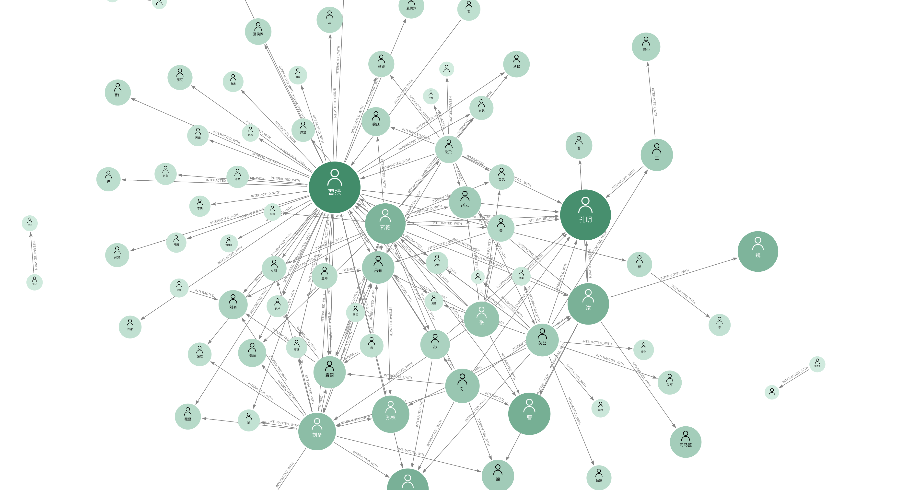
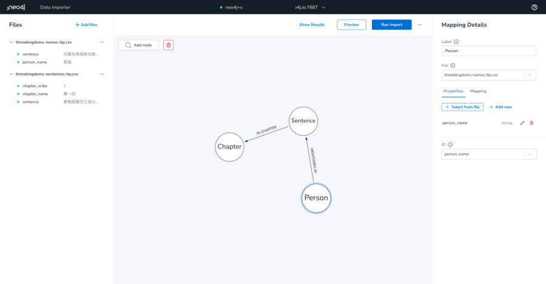

# Learn the "Three Kingdoms" with Graph by Neo4j

This repo is part of Shiny's session in the **NODES**. Please join us now: <https://neo4j.com/nodes-2022>


## What's the "Three Kingdoms"?

The "Three Kingdoms" tells the story of the fateful last reign of the Han dynasty (206 B.C.–A.D. 220) when the Chinese empire was divided into three warring kingdoms. This Ming dynasty masterpiece continues to be widely influential in China, Korea, Japan, and Vietnam and remains a great work of world literature that has become the Chinese national epic. 


You can find the full novel online: <https://zh.wikisource.org/zh-hans/%E4%B8%89%E5%9C%8B%E6%BC%94%E7%BE%A9>, learn more on Wikipedia: <https://en.wikipedia.org/wiki/Three_Kingdoms>.

## Exploring the people network of the "Three Kingdoms" with Neo4j

In this talk, Shiny will introduce a process of extract entities and relationships from the raw text. Then to model the graph data and use Neo4j tool sets easily build the graph database and explore the data.

All the tools from Neo4j that you can get it now and free. No need to maintain your own infrastructure. Just sign up the Neo4j Aura Free: <https://neo4j.com/cloud/aura>. Then you can follow the steps to build your own "Three Kingdoms" knowledge graph.



## Just Follow Me

### Get Raw Text

Using Python/Scrapy?

I'd like to recommend use APOC to do that.

You just need to install the Neo4j Desktop and install the APOC plugin. And run this Cypher:

```cypher
with 'https://so.gushiwen.cn/guwen/book_46653FD803893E4F7F702BCF1F7CCE17.aspx' as book_url
call apoc.load.html(book_url, {links:'div.bookcont ul span a'}) yield value as toc
with toc.links as chapter_links
unwind range(1, size(chapter_links)) as chapter_order
with chapter_order, chapter_links[chapter_order-1].text as chapter_name, chapter_links[chapter_order-1].attributes.href as chapter_link
call apoc.load.html(chapter_link, {ps:'div.contson p'}) yield value as chapter_content
with chapter_content.ps as paragraphs, chapter_order, chapter_name
unwind range(1, size(paragraphs)) as para_order
return chapter_order, chapter_name, para_order, trim(paragraphs[para_order-1].text) as para_content
```

Then you'd export it as `csv` file.

### Extract Sentences? Words? Names (NER)?

Use NLP~ or hard coding?

Yes. I use NLP: <https://github.com/HIT-SCIR/ltp>

#### First. You'd extract sentences:

```python
#!/usr/bin/env python3
# -*- coding: utf-8 -*-

from ltp import StnSplit

def populate_sentences(file):
    f = open(file, 'r')
    lines = f.readlines()

    for line in lines:
        parts = line.split(',')

        chapter_order = parts[0]
        chapter_name = parts[1]
        para_order = parts[2]
        para = parts[3]

        sent = StnSplit().split(para) # split sentences by LTP, see: http://ltp.ai/docs/quickstart.html

        for i in range(len(sent)):
            sentence_order = str(i + 1)
            sentence = sent[i]
            print(','.join([chapter_order, chapter_name, sentence]))

file = './sg/threekingdoms-content.csv'
populate_sentences(file)
```

Then you'd run it as:

```bash
(.venv) ancient-books-4 % python3 process_sentence.py > sg/threekingdoms-sentences-ltp.csv
```

#### Second. We need to extract names with NER

```python
#!/usr/bin/env python3
# -*- coding: utf-8 -*-

from ltp import LTP

def process_ner(file):
    f = open(file, 'r')
    lines = f.readlines()

    ltp = LTP()

    for line in lines:
        parts = line.split(',')

        chapter_order = parts[0]
        chapter_name = parts[1]
        sentence = parts[2].rstrip()

        o = ltp.pipeline([sentence], tasks=['cws', 'ner'])
        ners = o.ner

        for ne in ners[0]:
            if(ne[0] == 'Nh'):
                print(','.join([sentence, ne[1]]))

file = 'sg/threekingdoms-sentences-ltp.csv'
process_ner(file)
```

Run it as:

```bash
(.venv) ancient-books-4 % python3 process_names.py > sg/threekingdoms-names-ltp.csv
```

### Set up Neo4j AuraDB

Heading to <https://neo4j.com/cloud/aura> and sign up with your email. Then login to create your instance.

### Import data with the Data Importer



Add files `threekingdoms-sentences-ltp.csv` and `threekingdoms-names-ltp.csv`. Start Graph Data Modeling!

Run Import to execute the import job. Done!~

TODO:

### Explore with Neo4j Browser

TODO:

### Explore with Neo4j Bloom

TODO:

## Feedback

Please give me andy feedback and suggestions. 

Happy graphing! 
